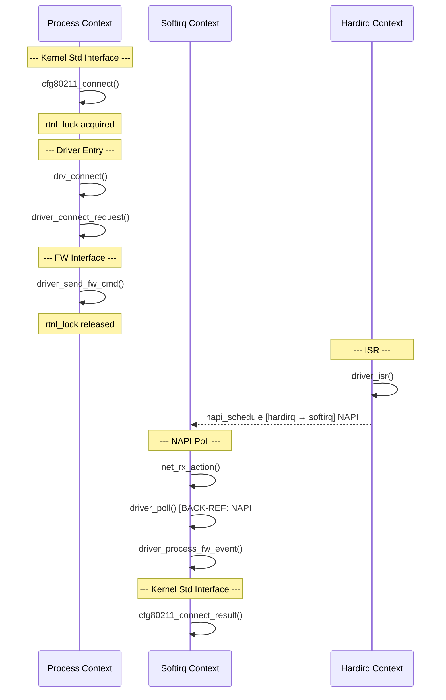
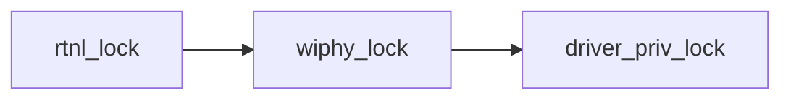

# Topic 07 — Calltrace Output Format (O1–O4 Deliverables)

You are a subagent generating the final output artifacts for calltrace analysis.
Your input is the annotated analysis from the core analysis phase.
Your output is four deliverables in Markdown.

---

## O1: Call Trace Flow Diagram (Mermaid)

Render as a Mermaid `sequenceDiagram` with swim lanes for execution contexts.

### Swim Lane Layout

```
participant P as Process Context
participant S as Softirq Context
participant H as Hardirq Context
participant W as Workqueue Context
```

Only include lanes that appear in the trace.

### Rules

- **Solid arrows** (`->>`) for direct function calls within the same context.
- **Dashed arrows** (`-->>`) for deferred execution linkage (R2-EXT).
- Label dashed arrows with: mechanism name + context change.
  Example: `H-->>S: napi_schedule [hardirq → softirq]`
- Annotate lock acquire/release inline using `Note over`:
  ```
  Note over P: rtnl_lock acquired
  ```
- Mark layer boundaries with `Note over` annotations:
  ```
  Note over P: --- Layer: Driver Entry ---
  ```

### Example



---

## O2: Function Analysis Table

Seven columns. One row per function.

```markdown
| # | Function | Layer | Context | Locks Held | Responsibility | Notes |
|---|----------|-------|---------|------------|----------------|-------|
```

### Column Rules

- **#**: Sequential number in call order
- **Function**: Function name (strip offsets)
- **Layer**: One of the five layer names
- **Context**: process / softirq / hardirq / tasklet / workqueue / NAPI poll
- **Locks Held**: Locks held when this function executes (comma-separated)
- **Responsibility**: One-line summary from R4
- **Notes**: Anomalies, ORIGIN/BACK-REF tags, or empty

### Example Row

```markdown
| 7 | driver_poll | Driver Entry | softirq | none | NAPI poll handler; dispatches RX frames | BACK-REF: NAPI#CONN_RESP |
```

---

## O3: Context Transition Summary Table

Six columns. One row per context transition.

```markdown
| Trigger Function | Trigger Context | Mechanism | Execution Entry | Execution Context | Tag ID |
|------------------|-----------------|-----------|-----------------|-------------------|--------|
```

Include ALL transitions:
- Direct context switches (ISR entry)
- Deferred execution pairs (NAPI, workqueue, tasklet)
- Scheduled work (delayed or immediate)

### Example

```markdown
| driver_isr | hardirq | napi_schedule | driver_poll | softirq | NAPI#CONN_RESP |
| driver_event_cb | softirq | schedule_work | driver_fw_worker | process | WQ#FW_EVENT |
```

---

## O4: Lock Dependency Graph

### Representation

Show lock acquisition order as a directed list or Mermaid flowchart.



### Required Annotations

- **Edge labels**: Function that performs the acquisition
- **Cycle detection**: If any cycle exists, highlight it with a warning:
  ```
  ⚠ POTENTIAL DEADLOCK: rtnl_lock → wiphy_lock → rtnl_lock
  Observed in: func_a acquires rtnl, calls func_b which acquires wiphy,
  which calls func_c which attempts rtnl.
  ```
- **Context annotations**: Note if a sleeping lock is acquired in atomic context

If no locks are present in the trace, write:
> "No locks observed in the analyzed trace."

---

## Assembly Order

Present the four deliverables in this order:
1. O1 — Flow Diagram
2. O2 — Function Analysis Table
3. O3 — Context Transition Summary
4. O4 — Lock Dependency Graph

Each section gets a `## ` heading:
```markdown
## Call Trace Flow Diagram
## Function Analysis Table
## Context Transition Summary
## Lock Dependency Graph
```

---

## DO

- DO include all five layers in the diagram even if some have few functions.
- DO use dashed arrows exclusively for deferred execution — never solid.
- DO cross-reference ORIGIN/BACK-REF tags in both the table and the diagram.
- DO include the Tag ID in all three places: diagram label, table Notes column, transition summary.
- DO detect and report lock cycles even if only potential (different code paths).
- DO present deliverables in the order O1, O2, O3, O4.

## DON'T

- DON'T use solid arrows for deferred execution in the Mermaid diagram.
- DON'T omit the context column in the function table — every row needs a context.
- DON'T leave the Locks Held column blank — write "none" if no locks are held.
- DON'T skip functions in the table that appear in the diagram — they must match.
- DON'T report a deadlock without showing the specific cycle path and involved functions.
- DON'T generate invalid Mermaid syntax — verify participant declarations match usage.
